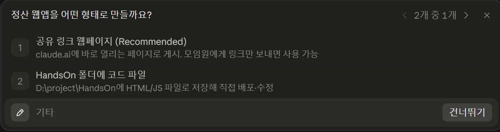
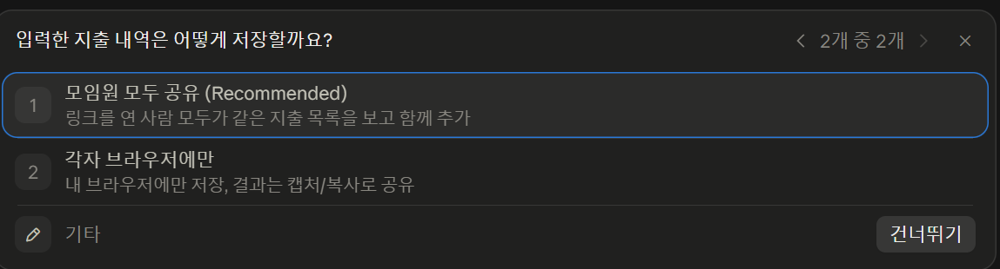
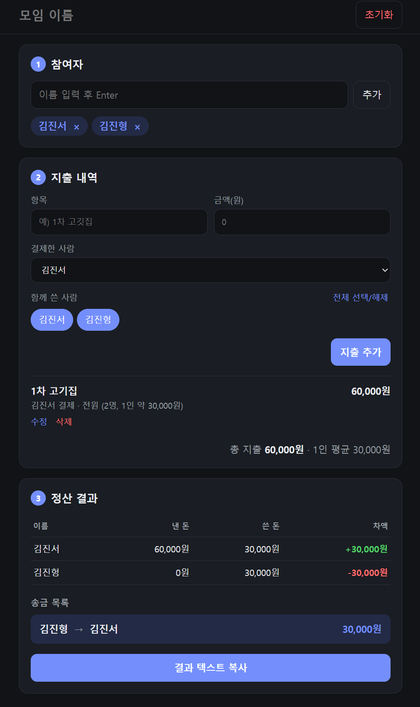
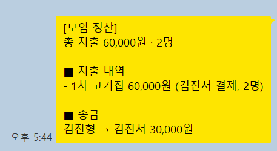

# Phase 0: 나이브 베이스라인

- 날짜 / 도구 / 모델: 2026-10-09, Claude Code, Sonnet 5.5 (medium)
- 태그: phase0-baseline (커밋 해시: abc1234)

## 턴별 기록
| 턴 | 내가 보낸 프롬프트 (원문) | AI가 한 일 |
|---|---|---|
| 1 | 모임 더치페이 정산 웹앱 만들어줘 | 형태/저장 방식을 질문 |
| 2 | 실행방법 알려줘 | 실행하는 방법을 2-3가지 알려줌 |
| 3 | 정산 로직에 대해서 설명해줘 | 3단계에 거친 정산 알고리즘을 설명 |

## 관찰 결과
### A. 요청하지 않았는데 AI가 임의로 결정한 것
- 파일 구조: index.html / app.js / settle.js / style.css로 분리
- 테마,색상 등 디자인적 요소
- 정산 결과 텍스트 복사 기능

### B. 동작한다고 했지만 실제로는 안 되는 것
- 인당 가격 불일치 : 소수점에 대한 규칙 부족
### C. 내가 원했던 것과 다르게 만들어진 것
- 술을 안먹은 사람, 텍시비 등등 다양한 변수에 대한 기능 부족 
- 정산 검증에 대한 로직 추가
- 페이지 별로 입력하고 마지막에 출력하는 것을 원했으나, 한 페이지에 모든 기능이 있었음.

## 다음 Phase로 가져갈 문제 (한계점 목록)
1. 더 다양한 기능에 대한 상세와 정산 규칙 정밀화
2. 결과 텍스트 문구 재정립
3. 파일 구조에 대한 상세 기획(아키텍쳐 재정립)
4. git 및 docs 관리 자동화
5. agent 및 skills, workflow, validation 등으로 작업 loop 구체화
